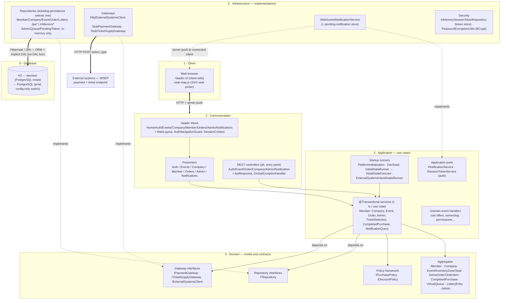
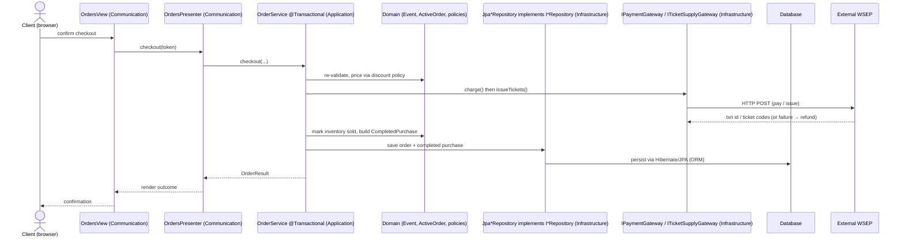

# Architecture (V3)

This document describes the runtime architecture of the ticketing platform for **V3**.

Per requirement **§6**, the system is organized into **six components** — **client**, **communication**,
**application**, **domain**, **infrastructure**, and **database**. Object-relational mapping
(Hibernate / JPA) is the **implicit data-access layer**: there is **no explicit DAL box** — persistence
is reached through domain repository interfaces whose JPA implementations let the ORM map aggregates to
tables transparently. The UI is **presenter-based** (Vaadin views delegate to presenters; carried over
from FIX-V2-9).

## Component diagram

**Legend.** Solid arrow = runtime call / dependency · dotted `implements` = a port (domain or
application) implemented in infrastructure (dependency inversion) · thick arrow = a process/network boundary
(client↔server, ORM↔DB, app↔external). The **ORM edge is deliberately an edge, not a box** — there is no
standalone DAL/DAO class in the codebase.

## The six components

### 1 · Client
The user's web browser running the Vaadin UI (rendered client-side by Vaadin Flow) plus
`seat-map.js`, an SVG/Lit seat-picker with keyboard/ARIA support. The client exchanges UI state with the
server over Vaadin's HTTP transport and **receives real-time notifications via server push**.

### 2 · Communication
The presentation tier (`com.ticketing.presentation`), which bridges the client and the application:
- **Vaadin Flow** views (`presentation.vaadin.views`) — `HomeView`, `AuthView`, `EventsView`,
  `CompanyView`, `OrdersView`, `AdminView`, `NotificationsView`, `MemberView`, `MainLayout`,
  with `AuthNavigationGuard` (route protection) and `SessionContext` (per-session token/role).
- **Presenters** (`presentation.vaadin.presenters`) — each view delegates its logic to a presenter
  (`AuthPresenter`, `EventsPresenter`, `CompanyPresenter`, `MemberPresenter`, `OrdersPresenter`,
  `AdminPresenter`, `NotificationsPresenter`); presenters call **application services** and return
  result records.
- **REST controllers** (`presentation.rest`) — an alternate programmatic entry point used by the
  acceptance tests (`AuthController`, `EventController`, `OrderController`, `CompanyController`,
  `AdminController`, `NotificationController`), wrapping responses in `ApiResponse` with a
  `GlobalExceptionHandler`.

Both entry points (UI presenters and REST controllers) funnel into the **same application services** — no
business logic lives in the presentation tier.

### 3 · Application
Use-case orchestration (`com.ticketing.application`). Each service method is **one atomic transaction**
(`@Transactional`, class-level `readOnly=true`, overridden read-write on mutating use cases — V3-10):
`MemberService`, `CompanyService`, `EventService`, `OrderService`, `AdminService`,
`TicketSelectionService`, `CompletedPurchaseService`, `NotificationQueryService`. Authentication is
issued/validated by `SessionTokenService` (`application.auth`, JWT), and notifications are emitted
through the application port `INotificationService` (implemented in infrastructure). Startup runners
live here:
`PlatformInitializationService` (registers the system admin, verifies gateways), `DevSeedDataInitializer`
(optional dev data), `InitialStateRunner` → `InitialStateExecutor` (optional file-driven bootstrap), and
`ExternalSystemsHandshakeRunner` (startup handshake). Domain-event handlers
(`application.listener`) react to domain events within the same transaction. The application layer depends
**only on domain interfaces** — never on infrastructure types.

### 4 · Domain
The DDD core (`com.ticketing.domain`) with **zero outbound dependencies**:
- **Aggregates / entities** — `Member`, `Company`, `Event` (+ `InventoryZone`, `Seat`, `VenueMap`),
  `ActiveOrder` (+ `OrderItem`), `CompletedPurchase` (immutable history snapshot), `VirtualQueue`,
  `LotteryEntry`, `Admin`; with value objects (`StaffAppointment`, `Suspension`, `PendingRoleOffer`,
  schedules, statuses).
- **Policy framework** — `IPurchasePolicy` and `IDiscountPolicy` hierarchies (e.g. `MaxQuantityPolicy`,
  `AgeRestrictionPolicy`, `And`/`Or`, simple/conditional/coupon discounts), composed in memory.
- **Ports (dependency inversion)** — repository interfaces (`IMemberRepository`, `ICompanyRepository`,
  `IEventRepository`, `IOrderRepository`, `IAdminRepository`, `IQueueRepository`, `ILotteryRepository`,
  `IPendingNotificationRepository`) and gateway interfaces (`IPaymentGateway`, `ITicketSupplyGateway`,
  `IExternalSystemsClient`). The domain **defines** these contracts; infrastructure **implements** them.
  (The notification port `INotificationService` is declared one layer out, in the **application** tier —
  see §3 — but is likewise implemented in infrastructure.)
- **Domain events** — `IEvent` / `IEventPublisher` / `IEventListener` for loosely-coupled reactions.

### 5 · Infrastructure
Technical implementations of the domain ports (`com.ticketing.infrastructure`):
- **Persistence** — for the five persisted aggregates (**Member, Company, Event, Order, Lottery**) two
  interchangeable implementations are selected by `@ConditionalOnProperty(ticketing.persistence)`:
  `InMemory*Repository` (default, `ConcurrentHashMap` + CAS versioning) or `Jpa*Repository` adapters that
  delegate to Spring Data repositories and translate JPA lock failures to the domain
  `OptimisticLockException` — exactly one per interface is active. The remaining repositories
  (**Admin, Queue, PendingNotification, SessionToken**) are **in-memory only**; the virtual queue is
  deliberately not persisted (transient state — V3-9).
- **Gateways** — `HttpExternalSystemsClient` (real WSEP HTTP client), `StubPaymentGateway`,
  `StubTicketSupplyGateway`.
- **Notification** — `WebSocketNotificationService` implements the application port `INotificationService`:
  pushes to connected listeners or stores to the pending-notification repository for offline users and
  flushes on reconnect.
- **Security** — session-token storage (`InMemorySessionTokenRepository`) and `PasswordEncryptionUtils`
  (BCrypt); the JWT `SessionTokenService` itself lives in `application.auth` (§3).

### 6 · Database
**H2** in-memory in **PostgreSQL-compatibility mode** for dev/tests, switchable to a real **PostgreSQL**
with no code change (all datasource settings are externalized to environment variables — V3-12). Schema
management via `ddl-auto` (default `none`).

### ORM as the implicit DAL
There is **no explicit DAL/DAO class anywhere** in the codebase (verified — no `Dao`, `DAL`, or
`DataAccess` types). **Hibernate / JPA (`jakarta.persistence`)** is the implicit data-access layer:
JPA-mode repositories use Spring Data + the `EntityManager`, and aggregates are mapped with field access,
`@Version` optimistic locking, `@Embeddable`/`@ElementCollection` for owned values, and
`@OneToMany(cascade=ALL, orphanRemoval=true)` for owned collections. In the diagram this is the **labeled
edge** between *Infrastructure* and *Database*, not a separate component.

## Request flows

### Synchronous use case — checkout (presenter path)

The whole service call is **one transaction**: a domain or persistence failure rolls back the DB writes
atomically, while the external payment/ticket steps are compensated (refund/cancel) as needed.

### Asynchronous notification — server push

Application use cases call `INotificationService.notify(memberId, message)`. The infrastructure
`WebSocketNotificationService` either **pushes immediately** to a connected client (via the
`NotificationListener` registered by `NotificationsView`/`NotificationsPresenter`, delivered through
`ui.access(...)`) or **stores** the message in the pending-notification repository and **flushes it on
reconnect** — so a member who was offline at send time receives it, once and in order, on next login
(req I.5).

## Cross-cutting concerns
- **Dependency inversion**: communication → application → **domain model + interfaces**; infrastructure
  implements the ports declared by the domain (repositories; payment/ticket/external gateways) and by the
  application (notification, session-token storage). No layer depends on a more concrete one.
- **Optimistic locking** via `@Version` on aggregates (`Event`, `InventoryZone`, `Seat`, `ActiveOrder`,
  `Company`, `LotteryEntry`), surfaced as the domain `OptimisticLockException`.
- **Configuration-driven** datasource, persistence mode, queue parameters, initial-state file and external
  base URL — all externalized to environment variables (see `README.md`).
